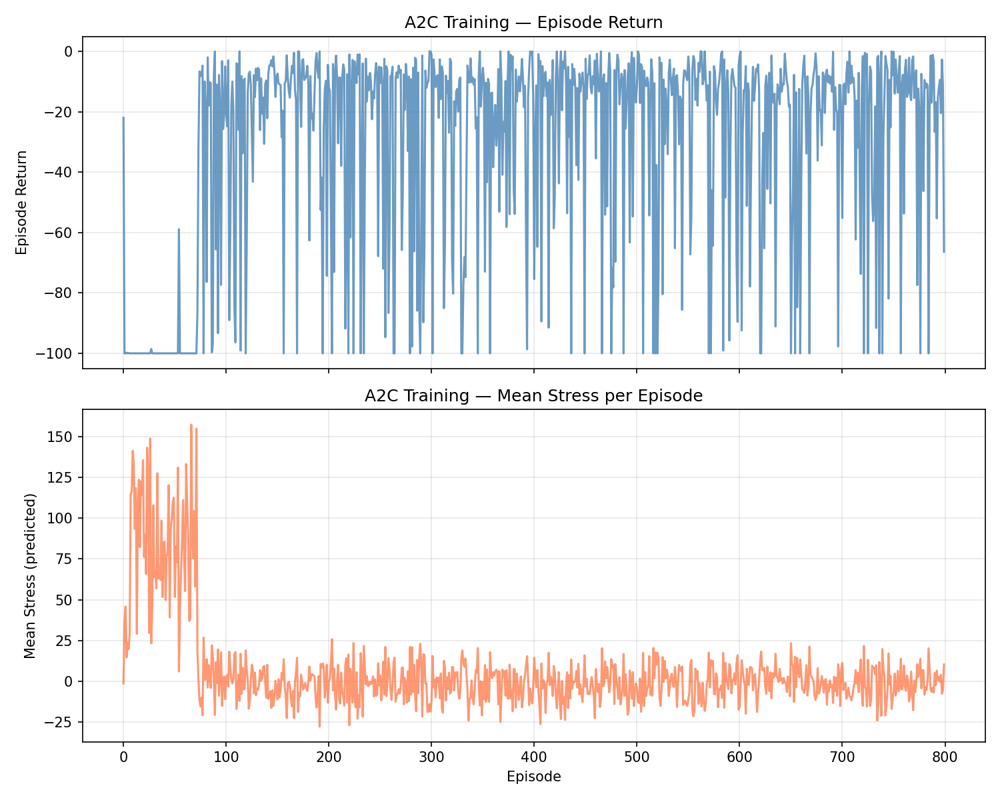
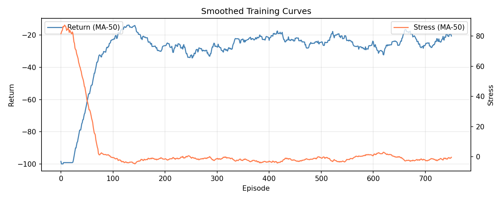
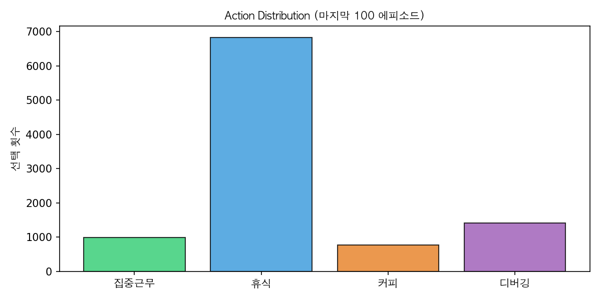

# Developer Stress A2C

**개발자 스트레스 시뮬레이션** 환경에서, 에이전트가 **스트레스를 낮추는 행동**(휴식, 디버깅 등)을 스스로 학습하도록 만든 프로젝트입니다. 사용한 강화학습 알고리즘은 **A2C(Advantage Actor-Critic)** 입니다. 이 문서에서는 A2C가 무엇인지, 왜 쓰는지부터 시작해, 우리가 만든 환경과 **실제 학습 결과 그래프**까지 이어서 설명합니다.

---

## 목차

1. [개요: 왜 A2C인가?](#1-개요-왜-a2c인가)
2. [핵심 구조: Actor와 Critic](#2-핵심-구조-actor와-critic)
3. [Advantage: "얼마나 더 좋았는가"](#3-advantage-얼마나-더-좋았는가)
4. [A3C와의 차이: 동기 vs 비동기](#4-a3c와의-차이-동기-vs-비동기)
5. [학습이 진행되는 순서](#5-학습이-진행되는-순서)
6. [정리 및 다음 단계](#6-정리-및-다음-단계)
7. [이 프로젝트에서의 적용](#7-이-프로젝트에서의-적용)
8. [실험 결과](#8-실험-결과)
9. [실행 방법](#9-실행-방법)

---

## 1. 개요: 왜 A2C인가?

강화학습에서는 크게 두 가지 흐름이 있습니다.

- **정책 기반:** "지금 이 상황에서는 이렇게 행동하자"를 직접 학습합니다.
- **가치 기반:** "이 상황/행동이 앞으로 얼마나 이득인지"를 먼저 학습합니다.

각각 장점이 있지만, **학습이 불안정하거나(결과가 들쭉날쭉)** **수렴이 느리다**는 단점이 있었습니다. **A2C는 이 두 방식을 합쳐서**, "어떤 행동을 할지"도 배우고 "그 선택이 얼마나 좋은지"도 함께 배우면서, **더 안정적이고 효율적으로** 학습하도록 만든 방법입니다.

---

## 2. 핵심 구조: Actor와 Critic

A2C에는 **두 역할**이 있습니다. 비유하면, 한 명은 **행동을 고르는 사람**, 한 명은 **그 선택에 점수를 매기는 사람**입니다.

- **Actor (행동을 고르는 쪽)**  
  현재 상태(업무시간, 수면, 버그 수 등)를 보고 **"지금은 휴식하자"**, **"지금은 디버깅하자"** 처럼 **할 행동을 선택**합니다.  
  학습 목표는 **"보상을 많이 받는 방향으로 선택 확률을 바꾸는 것"** 입니다.
- **Critic (점수를 매기는 쪽)**  
  Actor가 처한 **그 상태가 앞으로 얼마나 좋을지(가치)** 를 예측합니다.  
  학습 목표는 **"실제로 받은 보상과 예측한 가치의 차이를 줄이는 것"** 입니다.

둘은 **같은 신경망 안에서** 정보를 나누어 쓰고, 서로를 보완하면서 함께 업데이트됩니다.  
이 프로젝트에서는 **하나의 공유 네트워크 + Actor용 출력 + Critic용 출력**으로 구현했습니다.

---

## 3. Advantage: "얼마나 더 좋았는가"

단순히 "이 행동의 보상이 10이었다"라고만 쓰면, 보상 크기에 따라 학습이 요동칩니다.  
A2C는 그 대신 **Advantage**라는 값을 씁니다.

**Advantage = "이 행동이 평소 기대치보다 얼마나 더 좋았는가"**

```
A(s, a)  =  Q(s, a)  -  V(s)
                ↑        ↑
         이 행동의 가치   평균 기대 가치
```

- **`V(s)`** : 이 상태에서 **평균적으로** 얼마나 좋은지 (기대 점수, Critic이 예측)
- **`Q(s, a)`** : 이 상태에서 **이 행동을 했을 때** 얼마나 좋은지
- **`A(s, a)`** : 그 차이 → **"평소보다 나은 정도"**

이렇게 **상대적인 좋음**을 쓰면, 보상의 절대적인 크기에 덜 휘둘리면서 **학습이 안정**됩니다.  
우리 구현에서는 이 Advantage를 GAE로 계산한 뒤, **정규화(평균 0, 표준편차 1)** 해서 정책 학습에만 사용했습니다.

---

## 4. A3C와의 차이: 동기 vs 비동기

비슷한 이름의 **A3C**는 **비동기**로, 여러 에이전트가 각자 따로 경험을 모은 뒤 **제각각** 업데이트합니다.  
**A2C**는 **동기**로, 경험을 **한꺼번에 모아서 한 번에** 업데이트합니다.

| 구분         | A3C (비동기)                               | A2C (동기)                                 |
| ------------ | ------------------------------------------ | ------------------------------------------ |
| **업데이트** | 각자 따로                                  | 모아서 한 번에                             |
| **장점**     | CPU 여러 개 활용에 유리                    | GPU 배치 연산에 유리, 구현 단순            |
| **안정성**   | 업데이트 시점이 어긋나 흐름이 꼬일 수 있음 | 한 번에 맞춰서 업데이트해 흐름이 더 안정적 |

요즘은 GPU를 쓰는 경우가 많아서, **구현이 단순하고 성능도 괜찮은 A2C**를 많이 사용합니다.  
이 프로젝트도 매 **n_steps(기본값 5)마다 중간 업데이트**를 수행하는 진정한 n-step A2C 방식을 사용했습니다.

---

## 5. 학습이 진행되는 순서

1. **경험 수집**
   환경에서 n_steps 스텝 동안 **상태, 행동, 보상**을 기록합니다.
2. **Advantage 계산**
   그 보상들과 Critic이 예측한 가치 $V(s)$를 이용해, 각 시점의 **Advantage**를 GAE로 계산합니다.
3. **손실 계산 및 업데이트**

- **Actor:** Advantage가 큰 행동의 확률을 높이도록 손실을 잡고 업데이트
- **Critic:** 예측 가치와 실제 보상 합이 비슷해지도록 손실(MSE)을 잡고 업데이트
- **엔트로피:** 너무 한 가지 행동만 고르지 않도록 탐험을 유도하는 항을 더함  
  이 세 가지를 합친 **총 손실**로 한 번에 학습합니다.

4. **다음 스텝**
   업데이트된 정책으로 다시 환경과 상호작용하며 1번부터 반복합니다.

---

## 6. 정리 및 다음 단계

A2C는 **구현이 비교적 단순하면서도**, 정책 학습과 가치 평가를 같이 해서 **안정적으로 학습**할 수 있는 방법입니다.  
다만 "지금 정책으로만 수집한 데이터"를 쓰는 **온-폴리시** 특성 때문에 데이터 효율에는 한계가 있어, 더 나아가고 싶다면 **PPO(Proximal Policy Optimization)** 같은 방법으로 확장하는 것을 고려할 수 있습니다.

---

## 7. 이 프로젝트에서의 적용

앞에서 설명한 A2C를 **"개발자 스트레스"** 라는 문제에 그대로 적용했습니다.

### 7.1 데이터

- **데이터셋:** Kaggle의 Developer Stress Simulation Dataset (`developer_stress.csv`)
- **로드:** `kagglehub`로 자동 다운로드. 실패 시 **평균·표준편차 기반 Mock 데이터**로 대체합니다.

### 7.2 환경 (DevStressEnv)

에이전트가 놓인 **상태**와 **할 수 있는 행동**은 아래와 같습니다.

| 항목             | 내용                                                                                       |
| ---------------- | ------------------------------------------------------------------------------------------ |
| **상태 (7개)**   | 업무시간, 수면시간, 버그 수, 마감일, 커피 잔 수, 회의 수, 방해 횟수                        |
| **행동 (4가지)** | 0=집중근무, 1=휴식, 2=커피, 3=디버깅                                                       |
| **전이**         | 집중근무 → 업무·버그 증가 / 휴식 → 수면↑ 업무↓ / 커피 → 커피↑ 업무↑ / 디버깅 → 버그↓ 업무↑ |

### 7.3 보상

- 데이터로 **스트레스 수준**을 예측하는 회귀 모델(Ridge)을 학습해 두고,
- **보상 = -0.1 × (예측 스트레스)** 로 정의했습니다.  
  → **스트레스가 낮을수록 보상이 높고**, 스트레스가 높을수록 보상이 더 음수가 됩니다.
- 따라서 **Return(에피소드 누적 보상)은 항상 0 이하**이며,  
  **"Return이 높다" = "0에 가깝다(덜 음수)" = 스트레스를 잘 낮춘 정책**이라고 보면 됩니다.

### 7.4 학습 안정화 (적용한 개선)

| 기법                 | 내용                                                                                             |
| -------------------- | ------------------------------------------------------------------------------------------------ |
| **n-step 업데이트**  | 에피소드 전체가 아니라 매 n_steps(기본 5)마다 중간 업데이트를 수행하는 진짜 n-step A2C 방식 적용 |
| **시드 전환**        | 초반 절반은 시드 고정으로 학습 안정화, 후반 절반은 `seed=None`으로 랜덤 리셋해 과적합 완화       |
| **보상 스케일**      | `reward_scale=0.1`으로 스텝 보상 약 -1~~0, 에피소드 Return -100~~0 수준 유지                     |
| **Advantage 정규화** | 정책 그래디언트 학습 안정성 확보                                                                 |
| **엔트로피 보너스**  | 계수 0.05로 휴식·디버깅 같은 행동을 더 탐색하도록 유도                                           |

---

## 8. 실험 결과

아래 세 그래프는 **800 에피소드** 학습한 결과입니다.

### 8.1 에피소드별 원본 곡선



- **Episode Return (위):** 초반에는 **-100**까지 떨어지는 구간이 있으나, 약 100 에피소드부터 **-20 ~ 0** 구간으로 올라와 유지됩니다. 간헐적으로 -100 부근 스파이크가 남아 있는 것은 seed=None 구간에서 어려운 초기 상태가 주어졌을 때입니다.
- **Mean Stress (아래):** 초반 70 에피소드 안에서 **0~160** 수준으로 급등했다가, 이후 **거의 0** 수준으로 수렴합니다. 학습 초기 탐색 과정에서 스트레스가 높아지는 행동을 먼저 경험하고, 그 이후 빠르게 교정됩니다.

### 8.2 이동평균으로 본 추세 (MA-50)



- **초반(0~100):** Return은 **-100 → -20** 수준으로 급격히 상승하고, Stress도 높은 피크 이후 **거의 0**으로 급락합니다. 불과 100 에피소드 만에 스트레스를 낮추는 정책을 빠르게 수렴합니다.
- **중반(100~450):** Return은 **-20 ~ -30** 구간에서 비교적 안정적으로 유지됩니다. Stress는 **0 근처**로 낮게 유지되며, 에이전트가 스트레스 감소 전략을 고수하고 있음을 보여 줍니다.
- **후반(450~800):** seed=None 전환 이후에도 Return은 **-20 ~ -40** 수준을 유지하며, Stress가 소폭 오르내리지만 전반적으로 **0~5** 수준을 유지합니다. 시드를 랜덤으로 바꿔도 학습된 정책이 잘 일반화됨을 확인할 수 있습니다.

두 그래프 모두 **"스트레스 ↓ ⇒ Return ↑(덜 음수)"** 관계를 보여 주며, 보상 설계대로 **스트레스를 줄이는 방향으로 학습**이 이루어졌다고 해석할 수 있습니다.

### 8.3 Action Distribution (마지막 100 에피소드)



마지막 100 에피소드에서 에이전트가 선택한 행동의 분포입니다.

| 행동     | 선택 횟수 (근사) | 해석                                                        |
| -------- | ---------------- | ----------------------------------------------------------- |
| 집중근무 | ~1,000           | 버그·업무시간 증가 → 스트레스 상승 → 기피 학습              |
| **휴식** | **~6,800**       | 수면↑, 업무시간↓ → 스트레스 최대 감소 → **압도적으로 선호** |
| 커피     | ~800             | 커피잔↑ → 스트레스 감소 효과 작음 → 가장 적게 선택          |
| 디버깅   | ~1,400           | 버그↓ → 스트레스 감소 → 두 번째로 많이 선택                 |

에이전트는 스트레스를 가장 효과적으로 낮추는 **휴식(ACTION_REST)**을 압도적으로 선호하는 전략으로 수렴했습니다. 이는 환경 전이 함수에서 휴식이 수면시간 증가(+0.9) + 업무시간 감소(-0.5)로 스트레스 감소에 가장 유리하게 설계되어 있기 때문입니다. 디버깅도 버그 감소(-1.2)로 두 번째로 스트레스를 잘 낮추는 행동으로 학습되었습니다.

### 8.4 Return이 음수인 이유 (요약)

보상을 **매 스텝 "-0.1 × 스트레스"** 로 두었기 때문에, 스트레스가 0이 아닌 한 **한 스텝 보상은 0 이하**입니다.  
에피소드 Return은 그 보상들을 최대 100스텝만큼 더한 값이므로 **자연스럽게 0 이하**가 됩니다.  
**"성능이 좋다"는 것은 "Return이 0에 가깝다(예: -20, -30)"** 로 이해하면 됩니다.

---

## 9. 실행 방법

### 요구 사항

- Python 3.9+
- `requirements.txt` 에 명시된 패키지

### 설치 및 학습 실행

```bash
pip install -r requirements.txt
python train.py
```

### 주요 옵션

```bash
python train.py \
  --n-episodes 800 \   # 학습 에피소드 수 (기본 500)
  --n-steps 5 \        # 중간 업데이트 주기 (기본 5)
  --max-steps 100 \    # 에피소드당 최대 스텝 (기본 100)
  --lr 3e-4 \          # 학습률 (기본 3e-4)
  --seed 42 \          # 랜덤 시드 (후반부는 자동으로 랜덤 전환)
  --save-dir results   # 결과 저장 디렉터리
```

### 출력 파일

학습이 끝나면 `results/` 폴더에 다음 파일이 저장됩니다.

| 파일                         | 내용                                                     |
| ---------------------------- | -------------------------------------------------------- |
| `training_curves.png`        | 에피소드별 원본 Return · Stress 곡선                     |
| `training_curves_smooth.png` | MA-50 이동평균 스무딩 곡선                               |
| `action_dist.png`            | 마지막 100 에피소드 기준 Action Distribution 막대 그래프 |
